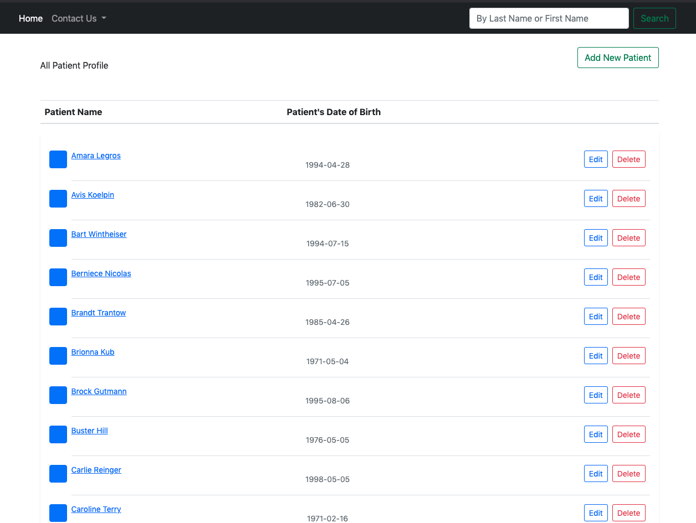
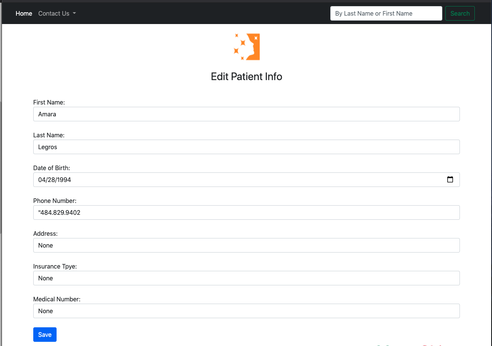
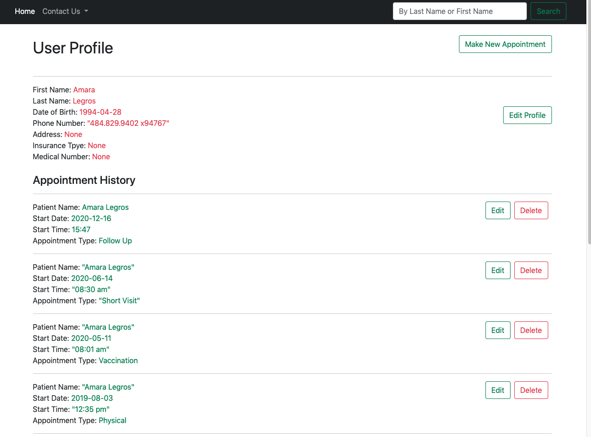
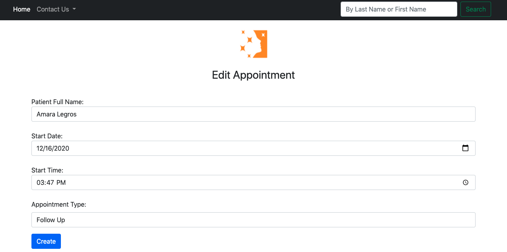
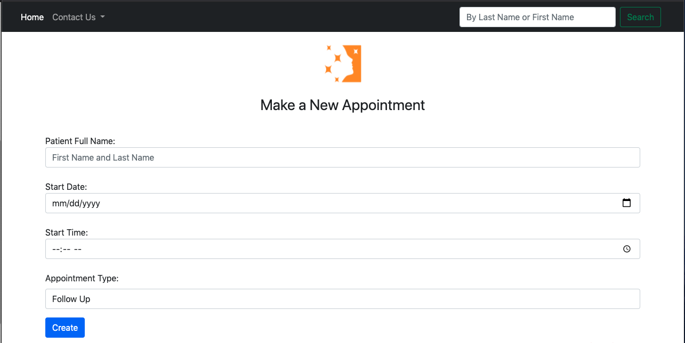

# Full_Stack_Demo
Created a web based tool to CRED patients and appointments information from an excel documents

# Medical Practice Web-based Tool
Video Demo: Link

# Prerequisites
1) Any Editor (Preferably Visual Studio Code)
2) Any web browser with latest version

# Languages and Technologies used
1) HTML5/CSS3
2) Python 
3) Python Flask 
4) Bootstrap (An HTML,CSS and JS library)
5) MySQL (used to store my database)
6) DB Browser for Sqlite (a platform to view database)

# Packages needed to install before running
2) type sudo pip install flask
3) type sudo pip install flask-sqlalchemy

# Steps to run the project on your computer
1) Clone or download the repository
2) Open the zip folder in Downloads
3) Open up terminal or Command Prompt
4) Go into the folder you just downloaded(Full_Stack_Demo)
5) In terminal or command prompt type python app.py
6) copy http://127.0.0.1:5000/ and paste it in any browser (Google Chrome Prefered)
1) To read in patients.cvs and appointment.cvs (--Optional--)
2) In terminal or command prompt type python patients (--Optional--)
3) In terminal or command prompt type python appointments (--Optional--)

# The Actual Project
This system has a "Home Page" where your able to view all the patients that is stored within the database. On the top of the page it has a navbar, on the left side there is a home button that will redirect you to Home, next to home there is a drop down called Contact Us. Inside it has a link to the companies website, IG and FB. To the right there is a Search bar that will allow you to search (by first or last name) for whichever patients you need to find (all ordered by First Name). Each Patient below has a Birth date to check whether if is the actual patient, as well as a edit and delete button for demographic information. Fig 1.1 shows the "Home Page".

                                                                        Fig 1.1

By clicking the button 'Add New Patient' on the upper right of our home page, it redirects to a page that lets you create a new patient based on the patient's First Name, Last Name, Date of Birth, Phone Number and if needed Address, Insurance Type and Medical Number for a easier process. Fig 1.2 shows the "Create New Patient Page". 

                                                                        Fig 1.2

By clicking the button 'Edit' on the home page, it redirects us to a page with the patients information already prefilled allows us to make changes(Fig 1.3). 

                                                                        Fig 1.3

Next to the 'Edit' button there is a 'Delete' button which allows us to delete the patient (Fig 1.4)

                                                                        Fig 1.4

By clicking on the patient's name it will redirect you to a page with the individual patient profile. On the patient profile, it displays all patient demographic information and a list of appointments, ordered by start date/time with the newest on top (Fig 1.5). On the 'User Profile page' your also able to modify the patient's demographic information as well as appointment information and of course deleting it too (Fig 1.6).

                                                                        Fig 1.5

                                                                        Fig 1.6

On the upper right side there is a 'Make New Appointment' button this is an interface to create a new appointment for an existing patient based on the patient full name, Start Date, Start Time, Appointment Type. Once the appointment is create is then order by the start-time and start_date on the "User Profile" page(Fig 1.7).

                                                                        Fig 1.7

